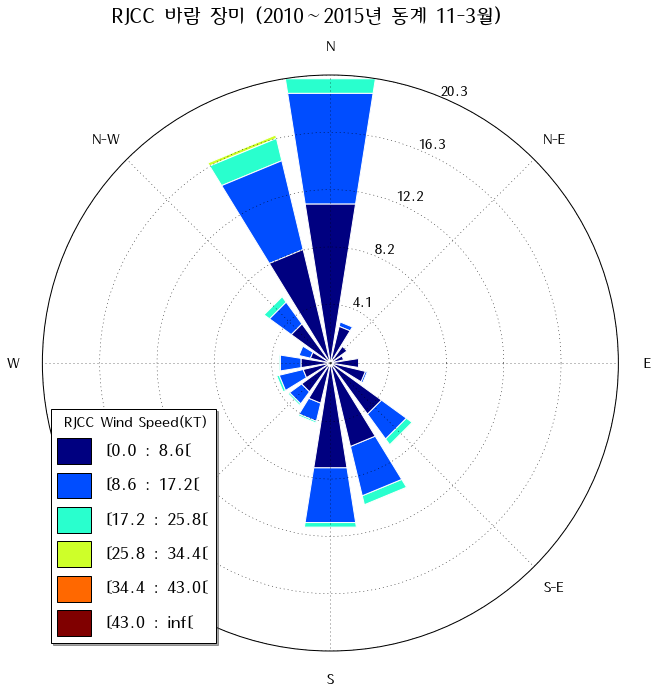
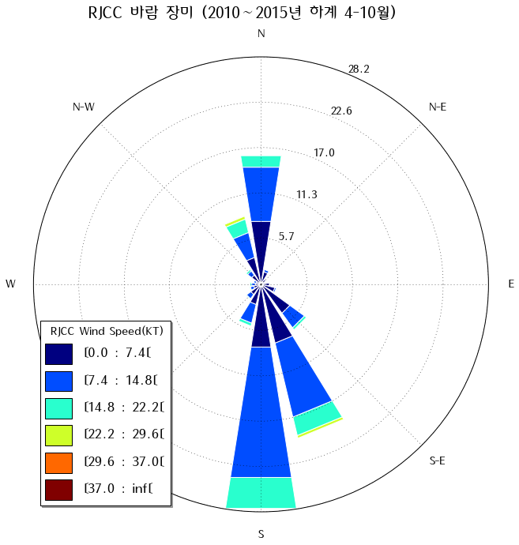
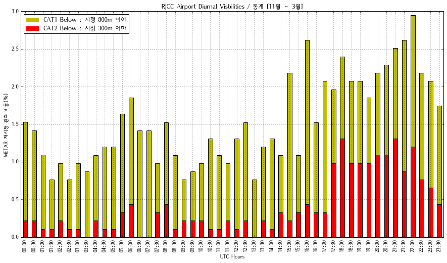
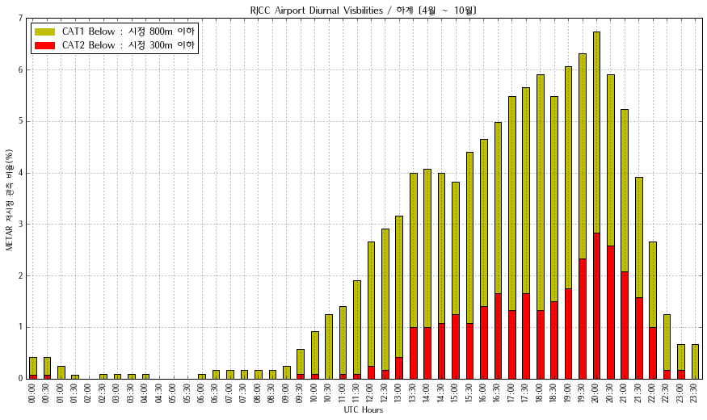
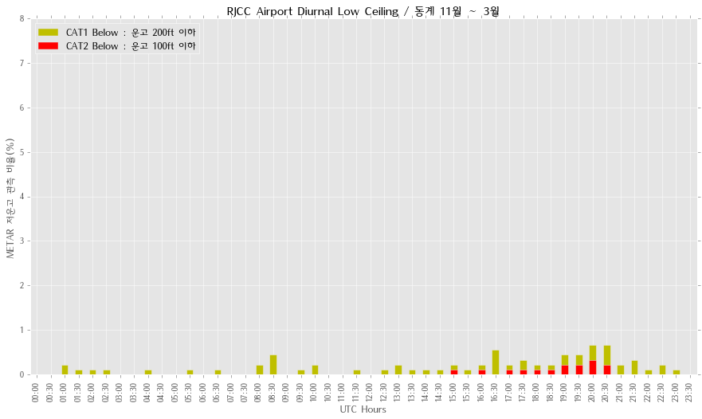
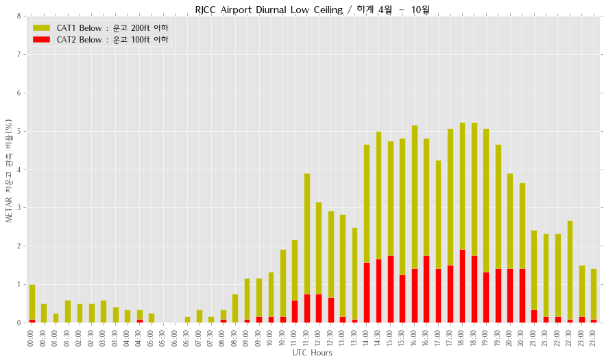

## CTS(RJCC) 치토세 공항 METAR(지상관측) 분석

* 바람

  **동계** 겨울철 바람의 주풍향은 북풍으로 RWY01이 주로 사용하게 될 이착륙 활주로에 해당.
  
  
  **하계** 여름철 바람의 주풍향은 남풍으로 RWY17이 주로 사용하게 될 이착륙 활주로에 해당.
  
  
  : 동계와 하계의 차이가 존재하는것은 겨울철은 북서쪽에서 확장하는 고기압의 영향을, 
  여름철에는 남서쪽에서 통과하는 저기압의 영향으로 볼수 있음.

* 시정

  **동계** 운항시간대가 현지 주간시간대이나 겨울철 강설로 인한 저시정 비율이 하계보다 높은편..
  

  **하계** 운항시간대가 현지 주간시간대이며, 강설 이외의 요인으로 저시정 비율이 동계보다 낮음.
  

  : 기상요인중 강설(눈)이 시정차폐하는 현상이 높음을 알수 있음.
  
* 운고

  **동계** 강설 현상이 발생하였을때 운고가 상대적으로 높은편이며, 안개 및 강수일때 저운고일 가능성이 높다.
  
  
  
  **하계** 강수 및 안개의 기상현상이 발생하였을때 저운고를 동반하는 비중이 높은편이다.
  
